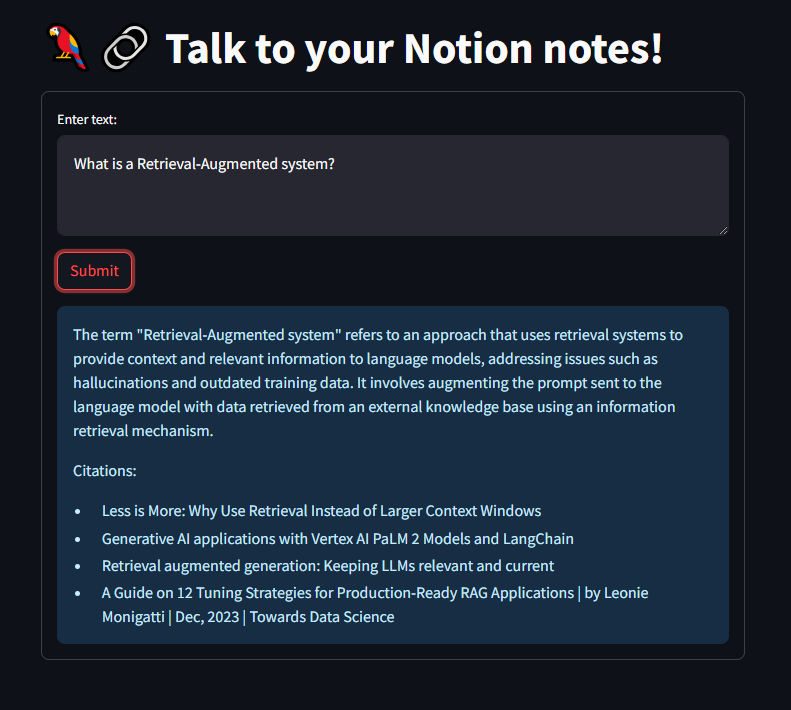
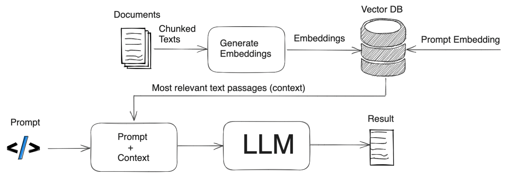

# NotionRag README

This repository contains a script that demonstrates how to preprocess and index documents using the LangChain library.



## Summary

The script allows you to interact with your notes stored in Notion using natural language. You can ask questions, and the script will retrieve the most relevant answers from your notes. It uses a retrieval-augmented model to search through your notes and provide accurate responses. Additionally, it provides citations for the sources of information, so you can easily refer back to the original notes.



This repository contains a script that demonstrates how to preprocess and index documents using the LangChain library. The script utilizes the LangChain library to leverage a Notion database as the source of documents. It follows a step-by-step process to achieve the following:

### Indexing phase

1. **Loading Documents**: The script uses the `NotionDBLoader` class to load documents from a Notion database.
2. **Document Splitting**: The loaded documents are split into smaller chunks using the `RecursiveCharacterTextSplitter` class.
3. **Metadata Preprocessing**: The metadata of each split document is preprocessed, ensuring data consistency when handling null values or complex data types.
4. **Vector Indexing**: The split documents are indexed and stored in the Chroma vector store. The `OpenAIEmbeddings` model is used for encoding the text.
5. **Index Building**: The script builds an efficient index for similarity search and retrieval of documents based on their textual content.

### QA Generation phase

Sure! In the QA Generation phase, the Retrieval-Augmented Generation (RAG) model is used to generate the response to a user's question. The RAG model combines retrieval-based and generation-based approaches to produce accurate and contextually relevant answers.

Here is a step-by-step overview of how the RAG model generates the response:

1. **Question Encoding**: The user's question is encoded into a dense vector representation using the same language model that was used during the indexing phase (e.g., OpenAI's GPT-3 or T5).

2. **Document Retrieval**: The encoded question is used to search the index created during the indexing phase. The search algorithm identifies the most relevant documents based on the similarity between the encoded question and the encoded documents.

3. **Contextual Encoding**: The retrieved documents are encoded using the same language model as the question. This ensures that the context of the retrieved documents is captured in the encoding.

4. **Answer Generation**: The encoded question and the encoded retrieved documents are passed as input to the language model for answer generation. The RAG model leverages the retrieval information to provide context-aware responses and take advantage of the rich information available in the retrieved documents.

The RAG model is designed to combine the strengths of retrieval-based approaches (accurate and contextually relevant answers) with the flexibility of generation-based approaches (ability to generate novel responses). This allows for more robust and comprehensive question answering.

## Getting Started

Requirements:
- Python >=3.8
- Chroma
- Langchain

To get started with the LangChain library and this script, follow these steps:

1. Clone this repository:
```shell
git clone https://github.com/unnikked/NotionRag.git
```

2. Copy .env.copy to .env and populate the required api keys and notion database id
```shell
cp .env.copy .env
```

3. Install the required dependencies:
```shell
pip install -r requirements.txt
```

4. Set up your Notion API credentials. Follow the instructions in the [LangChain documentation](https://langchain-docs.com) to obtain the necessary credentials.

5. Update the script with your Notion database details. Replace the placeholders in the script with your own database URL, token, and other relevant information.

6. Run the script:
```shell
python qa-rag.py
```

> The first time it will take a while to download and build your index. My notes took 5 minutes. 

## Docker

1. Build the image 
```shell
docker build --no-cache -t notionrag .
```

2. Run locally
```shell
docker run -rm --env-file .env -p 8501:8501 notionrag
```
## Contributing

Contributions are welcome! If you have any ideas, suggestions, or bug reports, please open an issue or submit a pull request.

## License

This project is licensed under the [MIT License](LICENSE).